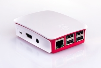
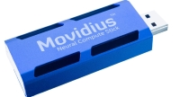
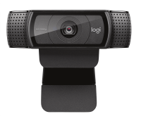

# Intel Movidius Neural Compute Stick Raspberry-Pi Webcam Installer
This project allows you to install a fully working person-detector using a single installation script.

We created this script so anyone can easily try this software/hardware out and experience what AI can do, to help you imagine what else you can do with it to help you in whatever project you're interested in!





## Prerequisites
For this project you need (at least):
- a [Raspberry-Pi model 3B+](https://www.raspberrypi.org/products/raspberry-pi-3-model-b-plus/)
- a [power adapter for the Raspberry-Pi](https://www.raspberrypi.org/products/raspberry-pi-universal-power-supply/)
- a 64GB microSD card (32GB would also just work)
- a wifi connection
- an [Intel Movidius Neural Compute Stick](https://developer.movidius.com/)
- a monitor with an hdmi interface
- hdmi cable (or at least compatible with the Raspberry-Pi hdmi interface)
- usb keyboard + usb mouse
- a webcam (we used the Logitech C920)
- a power outlet ;)

And preferrably also:
- a separate device (laptop/desktop) to access the cam stream remotely

## Installation steps
For the installation, you need to perform the following steps

### 1) Start strech OS on the Raspberry-Pi
- download strech OS
- burn the iso onto the SD card, for example using Etcher
- put the SD card into the Raspberry-Pi
- connect the keyboard and mouse to the Raspberry-Pi
- use the hdmi cable to connect the monitor and the Raspberry-Pi
- use the power adapter to connect the Raspberry-Pi to a power outlet
- wait until it has started
- go to the preferences menu option on the Raspberry-Pi and start 'Raspberry Pi Configuration'
- go to the localisation tab en set your wifi country
- connect the Raspberry-Pi to your wifi using the icon on the top of your screen

#### Enable ssh access
The easiest way to control the installation is from your PC/laptop, so it is advisable to enable SSH access on the pi, but you can also run everything on the Raspberry-Pi itself:
- go to the preferences menu option on the Raspberry-Pi and start 'Raspberry Pi Configuration'
- on the interfaces tab, enable 'ssh'
- check your IP address using `ifconfig` in a terminal
- on your PC/laptop, connect using `ssh pi@<ip>` using the default password `raspberry` (to be changed as you wish)

### 2) Update the firmware
Run in a terminal:
```
sudo rpi-update
```
And reboot afterwards:
```
sudo reboot
```

### 3) Clone this repository
```
git clone https://github.com/devolksbank/Raspberry-Pi-Movidius-Person-Detector
```

### 4) Call the installation script
The installation script can be called step-by-step, using:
```
./install-step1-ncs-api.sh
./install-step2-image-classifier.sh
./install-step3-opencv.sh
./install-step4-webcam.sh
```

Or by the single-command installer:
```
./install-full.sh
```

### 5) Test the installed streamer
First source the `~/.profile` to get the references to opencv right. Next, call:
```
cd ~/workspace/ncappzoo/caffe/NCS-Pi-Stream/ && python3 streamer_ncs.py
```

And watch the output via `http://localhost:8080/cam.mjpg` or remote via `http://<ip>:8080/cam.mjpg`.
Note that when watching via localhost, your Raspberry-Pi can quickly overheat!

## Thanks
Many thanks to the creators of these blogs/articles/repositories, which made creating this repository a lot easier:
- https://github.com/HanYangZhao/NCS-Pi-Stream
- https://www.pyimagesearch.com/2017/09/04/raspbian-stretch-install-opencv-3-python-on-your-raspberry-pi/

# Contact
For any questions please don't hesitate to contact us at [tc@devolksbank.nl](mailto:tc@devolksbank.nl)

